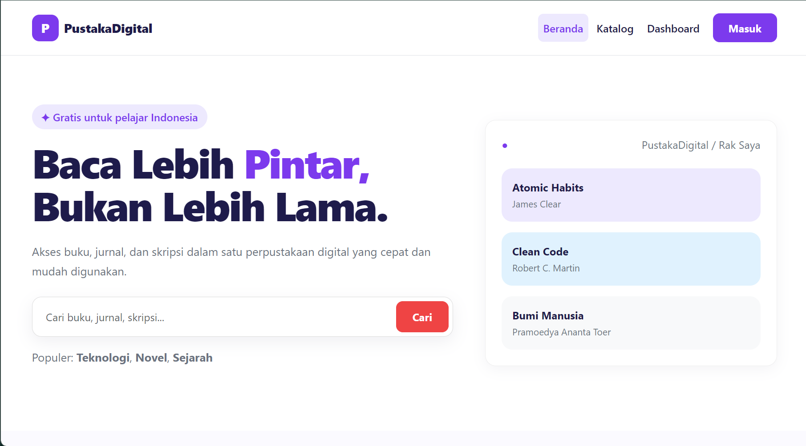
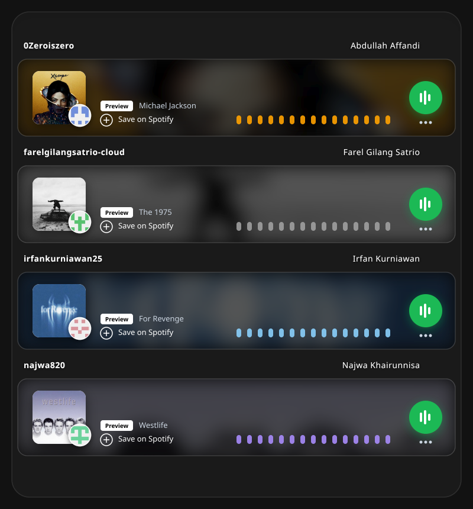

# Anggota Kelompok

# Tentang Proyek

**PustakaDigital** adalah sistem perpustakaan berbasis web yang dikembangkan untuk menjawab kebutuhan akan akses koleksi buku yang lebih cepat, praktis, dan terorganisir. Perkembangan teknologi mendorong perpustakaan untuk beralih dari sistem konvensional menuju sistem digital, karena perpustakaan konvensional memiliki keterbatasan dalam hal akses dan pencarian koleksi.

PustakaDigital hadir sebagai solusi dengan menyediakan katalog buku, fitur pencarian, detail buku, serta proses peminjaman buku secara digital. Sistem ini juga dilengkapi dengan **dashboard user** dan **dashboard admin** untuk mendukung pengelolaan perpustakaan yang lebih efisien.

---

## Latar Belakang

1. Perkembangan teknologi mendorong perpustakaan untuk beralih ke sistem digital.
2. Perpustakaan konvensional memiliki keterbatasan dalam akses dan pencarian koleksi.
3. Pengguna membutuhkan akses buku yang lebih cepat dan mudah.
4. Dibutuhkan sistem perpustakaan berbasis web yang praktis dan terorganisir.
5. PustakaDigital dikembangkan untuk menyediakan katalog, pencarian, detail, dan peminjaman buku.
6. Sistem juga menyediakan dashboard user dan admin untuk mendukung pengelolaan perpustakaan.

---

## Tujuan

- Mempermudah pengguna dalam mencari informasi buku yang tersedia di perpustakaan.
- Mempermudah proses peminjaman buku bagi pengguna.
- Mempermudah admin dalam mengelola data buku dan data perpustakaan.
- Mengurangi penggunaan proses manual dalam pengelolaan perpustakaan.
- Menyediakan sistem perpustakaan yang lebih cepat, praktis, dan terstruktur.
- Meningkatkan efisiensi pengelolaan perpustakaan dengan memanfaatkan teknologi berbasis web.

---

## Fitur

### 🔐 Login & Registrasi
Halaman autentikasi untuk masuk ke dalam sistem.

### 🏠 Dashboard User
Menampilkan ringkasan aktivitas membaca pengguna, meliputi:
- **Rak Saya** – koleksi buku pribadi
- **Sedang Dibaca** – buku dengan progres bacaan
- **Selesai Dibaca** – daftar buku yang telah selesai
- **Aktivitas Terbaru** – log aktivitas pengguna

### 📚 Katalog Buku
Halaman untuk menemukan buku favorit dengan fitur:
- Pencarian berdasarkan judul atau penulis
- Filter kategori: Semua, Pengembangan Diri, Teknologi, Novel, Sejarah
- Pengurutan koleksi (Terbaru)
- Kartu buku dengan informasi judul, penulis, rating, kategori, dan status ketersediaan

### 📖 Informasi Buku
Halaman detail buku yang menampilkan:
- Sampul dan judul buku
- Nama penulis
- Rating buku
- Deskripsi singkat
- Informasi penerbit, tahun terbit, dan jumlah halaman
- Aksi: **Tambah ke Rak** dan **Baca Buku**

### 🛠️ Dashboard Admin
Panel khusus admin untuk mengelola sistem PustakaDigital, mencakup:
- **Dashboard** – pantau seluruh aktivitas sistem
- **Katalog** – melihat katalog buku
- **Kelola Buku** – tambah, ubah, dan hapus data buku
- **Kelola Pengguna** – manajemen akun pengguna
- **Beranda** – halaman utama
- **Keluar** – logout dari sistem

## Future Release

Fitur-fitur yang direncanakan untuk rilis mendatang:
- Integrasi dengan reader
- Integrasi backend
- Optimalisasi UI dan UX